# PROYECTO FINAL 

# Predicción de Precios en Airbnb con Ciencia de Datos y Machine Learning

---

## Nombre: Ana Maria Olvera Salinas  
## Carrera: Ingeniería en Desarrollo de Software  
## Materia: Ciencia de Datos  
## Institución: Universidad Tecmilenio  

---

# 1. INTRODUCCIÓN

Actualmente, la Ciencia de Datos es una de las áreas más importantes dentro de la tecnología, ya que permite analizar grandes cantidades de información para encontrar patrones, realizar predicciones y apoyar la toma de decisiones.

En este proyecto trabajé con una base de datos real de Airbnb obtenida desde Kaggle. El objetivo principal fue analizar qué factores influyen en el precio de las propiedades y construir un modelo de Machine Learning capaz de realizar predicciones utilizando datos reales.

Durante el desarrollo del proyecto apliqué distintas etapas del flujo de trabajo de Ciencia de Datos:

- Exploración de datos  
- Limpieza y preparación de información  
- Visualización de datos  
- Análisis de correlación  
- Construcción de un modelo predictivo  
- Evaluación de resultados  
- Interpretación y comunicación de hallazgos  

Este proyecto me permitió fortalecer habilidades en:

- Python  
- Machine Learning  
- Análisis Exploratorio de Datos (EDA)  
- Regresión Lineal Múltiple  
- Limpieza de datasets  
- Visualización e interpretación de datos  

---

# 2. OBJETIVO GENERAL

Desarrollar un modelo predictivo utilizando Python y técnicas de Machine Learning para identificar qué variables influyen en el precio de propiedades publicadas en Airbnb.

---

# 3. OBJETIVOS ESPECÍFICOS

- Cargar y explorar una base de datos real.  
- Analizar la estructura del dataset.  
- Identificar valores faltantes.  
- Limpiar y preparar los datos.  
- Generar visualizaciones gráficas.  
- Analizar correlaciones entre variables.  
- Construir un modelo predictivo.  
- Evaluar el desempeño del modelo.  
- Interpretar los resultados obtenidos.  

---

# 4. PROBLEMA DE INVESTIGACIÓN

Los precios de propiedades en Airbnb cambian dependiendo de diferentes características como:

- Capacidad de huéspedes  
- Número de habitaciones  
- Número de baños  
- Número de camas  
- Calificaciones de usuarios  
- Tipo de propiedad  
- Ubicación  

Sin embargo, no siempre es fácil identificar cuáles variables influyen más en el precio.

Por ello se planteó la siguiente pregunta:

## ¿Qué variables influyen en el precio de las propiedades publicadas en Airbnb?

---

# 5. JUSTIFICACIÓN

Este proyecto es importante porque permite aplicar técnicas reales de Ciencia de Datos sobre información del mundo real.

El análisis de precios en Airbnb puede utilizarse para:

- Estimar precios automáticamente  
- Ayudar a propietarios a definir precios competitivos  
- Analizar tendencias del mercado  
- Detectar propiedades sobrevaloradas  
- Apoyar decisiones comerciales  

Además, este proyecto permitió fortalecer conocimientos prácticos en:

- Python  
- Pandas  
- Machine Learning  
- Visualización de datos  
- Interpretación estadística  

---

# 6. FLUJO GENERAL DEL PROYECTO

El proyecto fue desarrollado siguiendo las etapas principales de un proyecto de Ciencia de Datos.

## Etapas realizadas

1. Obtención de datos  
2. Exploración inicial del dataset  
3. Limpieza y preparación de datos  
4. Análisis Exploratorio de Datos (EDA)  
5. Visualización de información  
6. Análisis de correlación  
7. Selección de variables  
8. Construcción del modelo predictivo  
9. Evaluación del modelo  
10. Interpretación y comunicación de resultados  

---

# 7. DESCRIPCIÓN DEL DATASET

## Fuente

Kaggle — Airbnb Price Prediction Dataset

## Archivo utilizado

`train.csv`

## Información general

- 74,111 registros  
- 29 columnas  
- Información real de propiedades Airbnb  

## Variables principales utilizadas

| Variable | Descripción |
|---|---|
| log_price | Precio del alojamiento |
| accommodates | Cantidad de huéspedes |
| bathrooms | Número de baños |
| bedrooms | Número de habitaciones |
| beds | Número de camas |
| review_scores_rating | Calificación de usuarios |

---

# 8. IMPORTACIÓN DE LIBRERÍAS

```python
# Manipulación de datos
import pandas as pd
import numpy as np

# Visualización
import matplotlib.pyplot as plt
import seaborn as sns

# Machine Learning
from sklearn.model_selection import train_test_split
from sklearn.linear_model import LinearRegression

# Métricas
from sklearn.metrics import r2_score
from sklearn.metrics import mean_squared_error
```

## Explicación

Las librerías fueron utilizadas para distintas tareas:

- Pandas → manipulación y limpieza de datos  
- NumPy → operaciones numéricas  
- Matplotlib y Seaborn → creación de gráficas  
- Scikit-learn → construcción y evaluación del modelo  

---

# 9. CARGA DE LA BASE DE DATOS

```python
df = pd.read_csv("train.csv")

df.head()
```

## Explicación

La función `read_csv()` permitió cargar la base de datos dentro de Python.

Posteriormente utilicé `head()` para visualizar las primeras filas y verificar que el dataset se cargó correctamente.

---


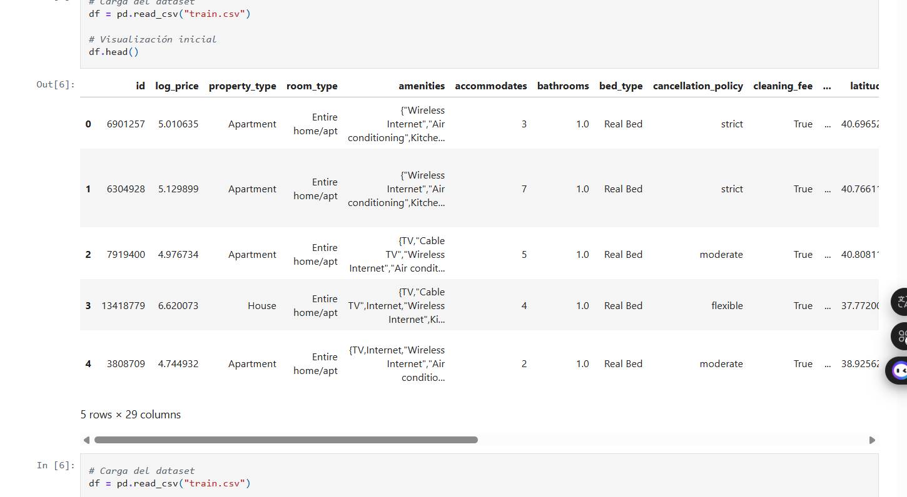

---

# 10. EXPLORACIÓN INICIAL DEL DATASET

```python
df.shape

df.info()

df.describe()
```

## Explicación

Estas funciones permitieron analizar:

- Cantidad de filas y columnas  
- Tipos de datos  
- Variables numéricas y categóricas  
- Estadísticas generales  
- Existencia de valores faltantes  

## Resultados obtenidos

- 74,111 registros  
- 29 columnas  
- Variables numéricas y categóricas  
- Presencia de valores nulos  
- Existencia de valores extremos en precios  

## Interpretación

La exploración inicial permitió comprender mejor la estructura del dataset y detectar posibles problemas antes de construir el modelo predictivo.

También ayudó a identificar cuáles variables podían ser útiles para analizar el precio de las propiedades.

---


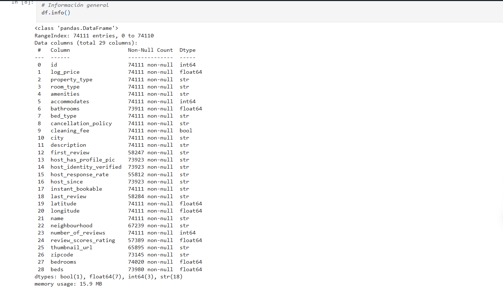
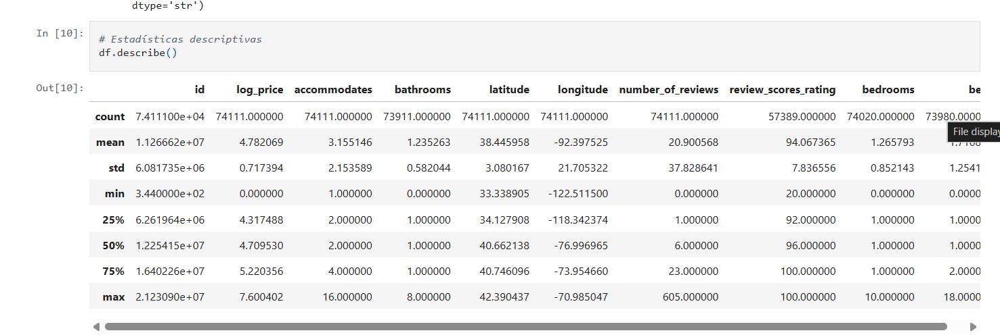


---

# 11. IDENTIFICACIÓN DE VALORES NULOS

```python
df.isnull().sum()
```

## Resultados obtenidos

| Variable | Valores Nulos |
|---|---|
| review_scores_rating | 16722 |
| bathrooms | 200 |
| bedrooms | 91 |
| beds | 131 |

## Interpretación

Los valores faltantes representan un problema importante porque pueden afectar negativamente el rendimiento del modelo predictivo.

Por ello fue necesario realizar un proceso de limpieza e imputación de datos.

---


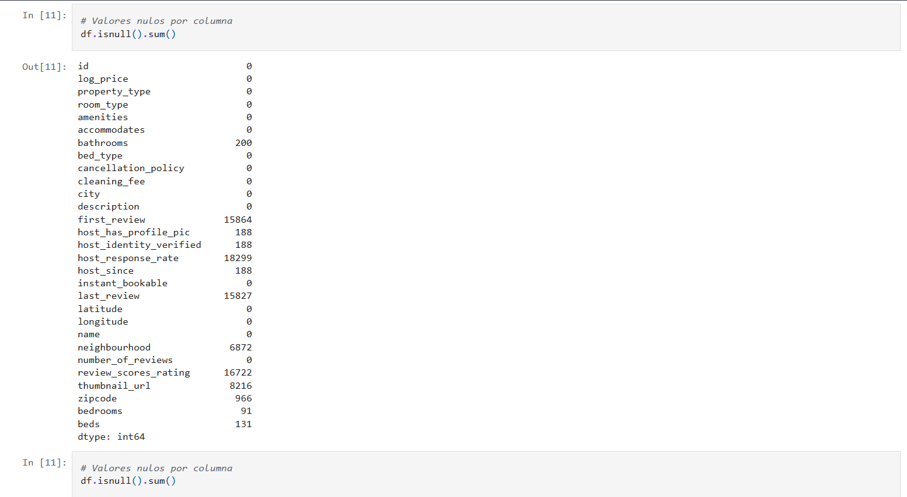

---

# 12. LIMPIEZA E IMPUTACIÓN DE DATOS

```python
df["review_scores_rating"] = df["review_scores_rating"].fillna(
    df["review_scores_rating"].mean()
)

df["bathrooms"] = df["bathrooms"].fillna(
    df["bathrooms"].median()
)

df["bedrooms"] = df["bedrooms"].fillna(
    df["bedrooms"].median()
)

df["beds"] = df["beds"].fillna(
    df["beds"].median()
)
```

## Explicación

Para completar los datos faltantes utilicé distintas técnicas estadísticas.

### Media

Fue utilizada en:

- `review_scores_rating`

Porque se trata de una variable continua relacionada con calificaciones.

### Mediana

Fue utilizada en:

- `bathrooms`
- `bedrooms`
- `beds`

Porque estas variables pueden verse afectadas por valores extremos.

## Interpretación

La limpieza permitió trabajar con un dataset más estable y confiable para el entrenamiento del modelo de Machine Learning.

También ayudó a conservar información importante sin eliminar demasiados registros.

---

# 13. DETECCIÓN DE VALORES ATÍPICOS (OUTLIERS)

```python
sns.boxplot(x=df["log_price"])

plt.title("Detección de Valores Atípicos")

plt.show()
```

## Explicación

El boxplot permitió detectar propiedades con precios extremadamente altos comparados con la mayoría del dataset.

## Interpretación

Los valores atípicos pueden generar ruido y afectar negativamente las predicciones del modelo.

Por ello fue necesario identificarlos antes de entrenar el modelo.

---


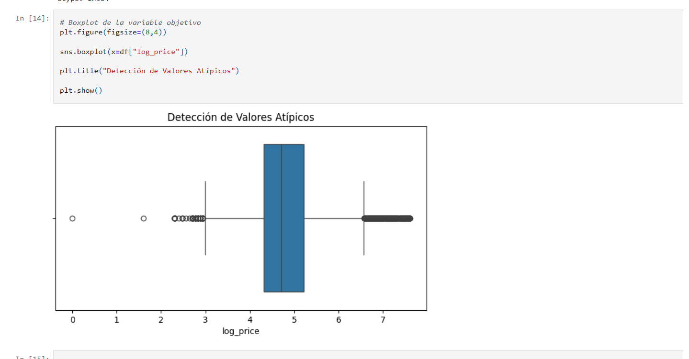

---

# 14. ELIMINACIÓN DE OUTLIERS CON IQR

```python
Q1 = df["log_price"].quantile(0.25)
Q3 = df["log_price"].quantile(0.75)

IQR = Q3 - Q1

limite_inferior = Q1 - 1.5 * IQR
limite_superior = Q3 + 1.5 * IQR

df = df[
    (df["log_price"] >= limite_inferior) &
    (df["log_price"] <= limite_superior)
]
```

## Explicación

El método IQR permite detectar observaciones demasiado alejadas del comportamiento general de los datos.

## Interpretación

Después de eliminar los outliers, la distribución de precios quedó más equilibrada y el modelo pudo trabajar con datos más representativos.

Esto ayudó a mejorar la estabilidad de las predicciones.

---


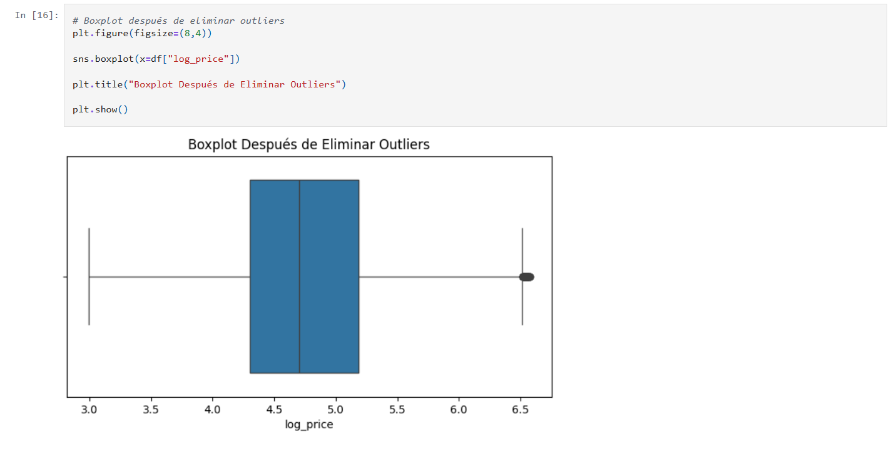

---

# 15. ANÁLISIS EXPLORATORIO DE DATOS (EDA)

## Histograma de precios

```python
plt.hist(df["log_price"], bins=50)

plt.title("Distribución del Precio")

plt.xlabel("Log Price")

plt.ylabel("Frecuencia")

plt.show()
```

## Interpretación

El histograma mostró cómo se distribuyen los precios de las propiedades.

La mayoría de alojamientos se concentran en rangos de precios medios.

---


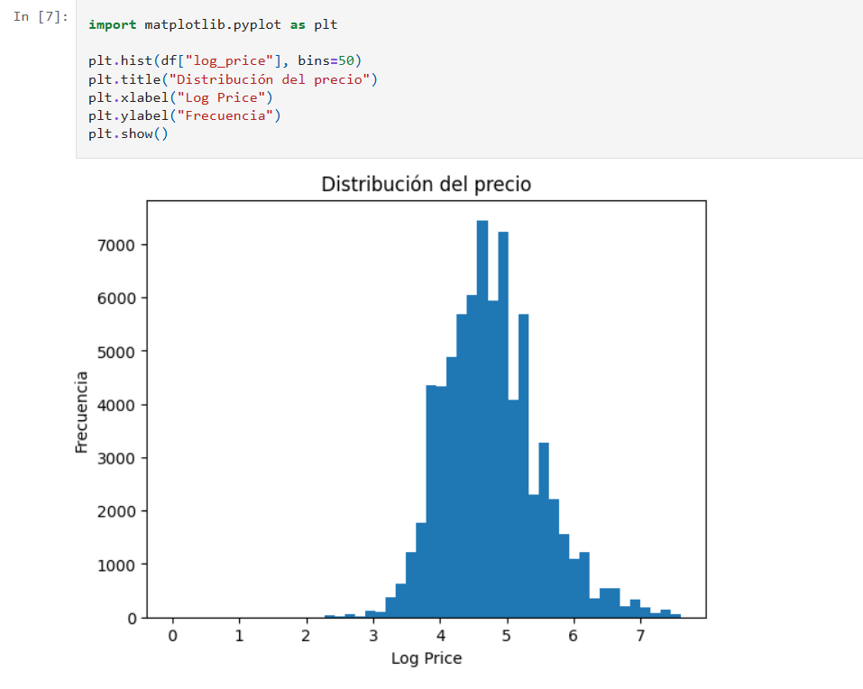

---

## Relación entre capacidad y precio

```python
plt.scatter(df["accommodates"], df["log_price"])

plt.xlabel("Capacidad")

plt.ylabel("Precio")

plt.title("Relación entre Capacidad y Precio")

plt.show()
```

## Interpretación

La gráfica mostró que mientras mayor capacidad tiene una propiedad, mayor suele ser su precio.

Esto indica una relación positiva importante entre ambas variables.

---

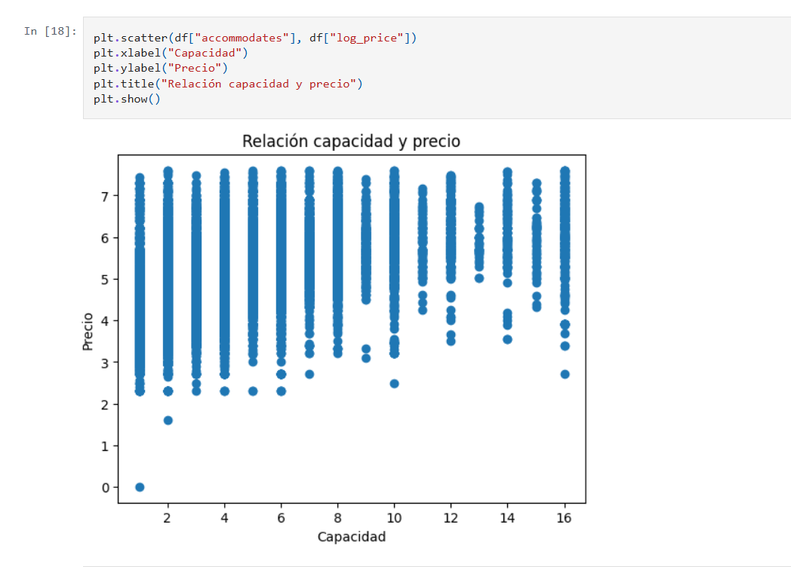

---

## Precio por tipo de habitación

```python
sns.boxplot(
    x="room_type",
    y="log_price",
    data=df
)

plt.title("Precio por Tipo de Habitación")

plt.show()
```

## Interpretación

Las propiedades completas suelen tener precios más elevados que habitaciones privadas o compartidas.

---


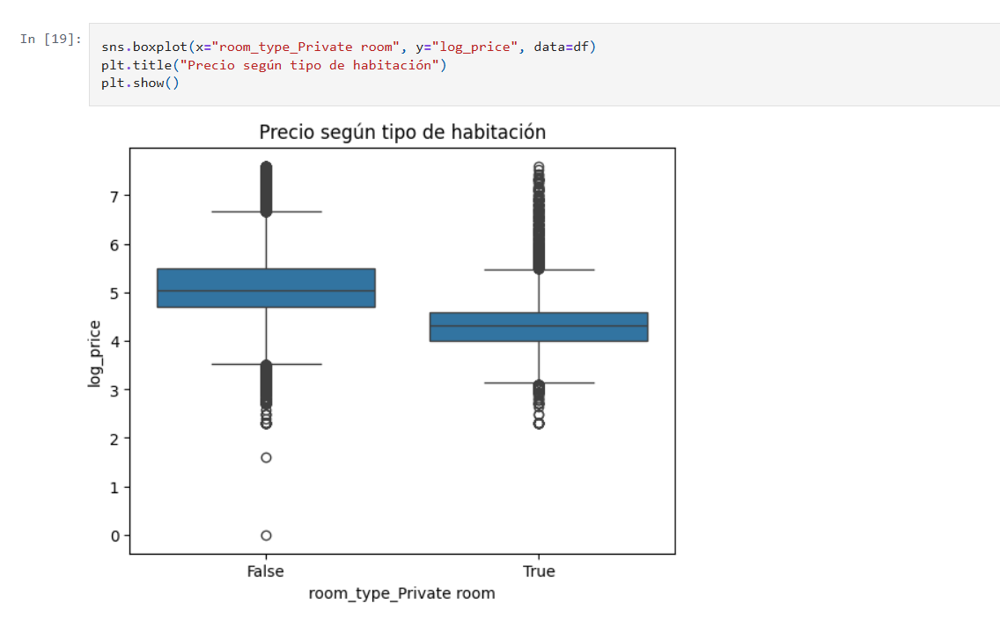

---

# 16. ANÁLISIS DE CORRELACIÓN

```python
correlacion = df.corr(numeric_only=True)["log_price"]

print(correlacion.sort_values(ascending=False))
```

## Resultados obtenidos

| Variable | Correlación |
|---|---|
| accommodates | 0.54 |
| bedrooms | 0.43 |
| beds | 0.43 |
| bathrooms | 0.28 |

## Interpretación

La variable con mayor relación respecto al precio fue `accommodates`.

Esto significa que la capacidad de huéspedes influye fuertemente en el precio del alojamiento.

También habitaciones, camas y baños mostraron relaciones positivas importantes.

## Heatmap de correlación

```python
sns.heatmap(
    df.corr(numeric_only=True),
    annot=True,
    cmap="coolwarm"
)

plt.title("Mapa de Correlación")

plt.show()
```

## Interpretación

El heatmap permitió visualizar de manera clara las relaciones entre variables numéricas.

Además, ayudó a identificar qué variables tenían mayor influencia sobre el precio.

---

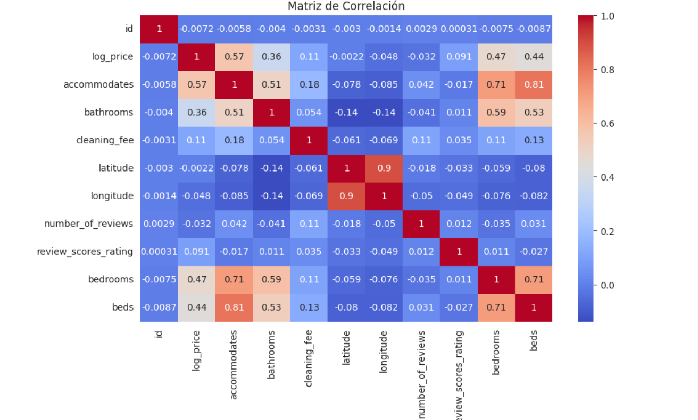

---
# 16.1 ANÁLISIS VISUAL CON PAIRPLOT

```python
variables = [
    "log_price",
    "accommodates",
    "bathrooms",
    "bedrooms",
    "beds",
    "review_scores_rating"
]

sns.pairplot(df[variables])

plt.show()
```

## Explicación

El pairplot permitió visualizar de forma simultánea la relación entre múltiples variables numéricas del dataset.

Esta gráfica muestra:

- Distribuciones individuales de cada variable.
- Relaciones entre pares de variables.
- Tendencias positivas o negativas.
- Posibles patrones dentro de los datos.

## Interpretación

El pairplot permitió identificar relaciones importantes entre las variables utilizadas dentro del modelo predictivo.

Se observaron tendencias positivas entre:

- accommodates y log_price
- bedrooms y log_price
- bathrooms y log_price

Esto indica que propiedades con mayor tamaño, más habitaciones y mayor capacidad tienden a presentar precios más altos.

También permitió observar que algunas variables presentan relaciones moderadas entre sí, aunque no se detectaron correlaciones extremadamente altas que indicaran problemas severos de multicolinealidad.

Además, esta visualización ayudó a comprender mejor el comportamiento general del dataset antes del entrenamiento del modelo.

---

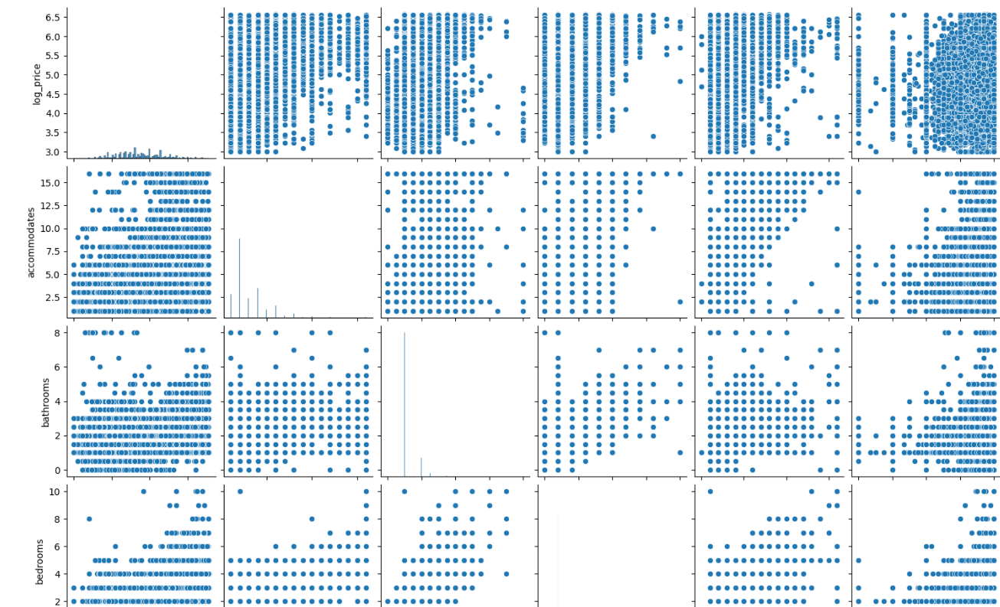
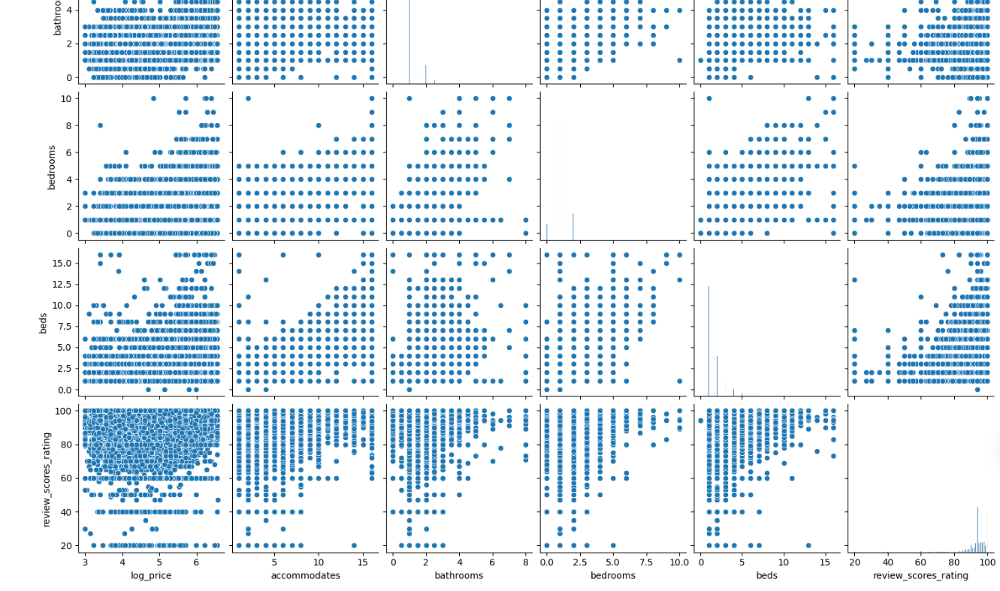

# 17. SELECCIÓN DE VARIABLES

```python
X = df[[
    "accommodates",
    "bathrooms",
    "bedrooms",
    "beds",
    "review_scores_rating"
]]

y = df["log_price"]
```

## Explicación

### Variables independientes (X)

Son las características utilizadas para realizar predicciones.

### Variable dependiente (y)

Es la variable que el modelo intenta predecir.

En este caso:

- `log_price`

## Interpretación

Estas variables fueron seleccionadas porque mostraron relación lógica y estadística con el precio de las propiedades.

---

# 18. ¿POR QUÉ UTILICÉ REGRESIÓN LINEAL MÚLTIPLE?

Elegí Regresión Lineal Múltiple porque el problema consiste en predecir un valor numérico continuo, en este caso el precio de propiedades Airbnb.

Este modelo permite analizar cómo varias variables influyen simultáneamente sobre el precio y facilita interpretar la importancia de cada característica.

La regresión lineal es uno de los modelos más utilizados en Machine Learning para problemas de predicción numérica.

---

# 19. DIVISIÓN DE DATOS

```python
X_train, X_test, y_train, y_test = train_test_split(
    X,
    y,
    test_size=0.2,
    random_state=42
)
```

## Explicación

Los datos fueron divididos en:

- 80% entrenamiento  
- 20% prueba  

## Interpretación

Esto permitió entrenar el modelo con una parte de los datos y evaluarlo posteriormente utilizando datos nuevos que el modelo nunca había visto.

---

# 20. CONSTRUCCIÓN DEL MODELO

```python
model = LinearRegression()

model.fit(X_train, y_train)
```

## Explicación

La Regresión Lineal Múltiple busca encontrar relaciones matemáticas entre las variables independientes y el precio.

## Interpretación

Durante el entrenamiento el modelo aprendió patrones relacionados con:

- capacidad de huéspedes,
- habitaciones,
- baños,
- camas,
- calificaciones.

---

# 21. ANÁLISIS DE MULTICOLINEALIDAD

```python
sns.heatmap(
    X.corr(),
    annot=True,
    cmap="coolwarm"
)

plt.title("Correlación entre Variables Independientes")

plt.show()
```

## Interpretación

No se encontraron correlaciones extremadamente altas entre variables independientes.

Esto significa que las variables aportan información útil sin generar redundancia excesiva.

---


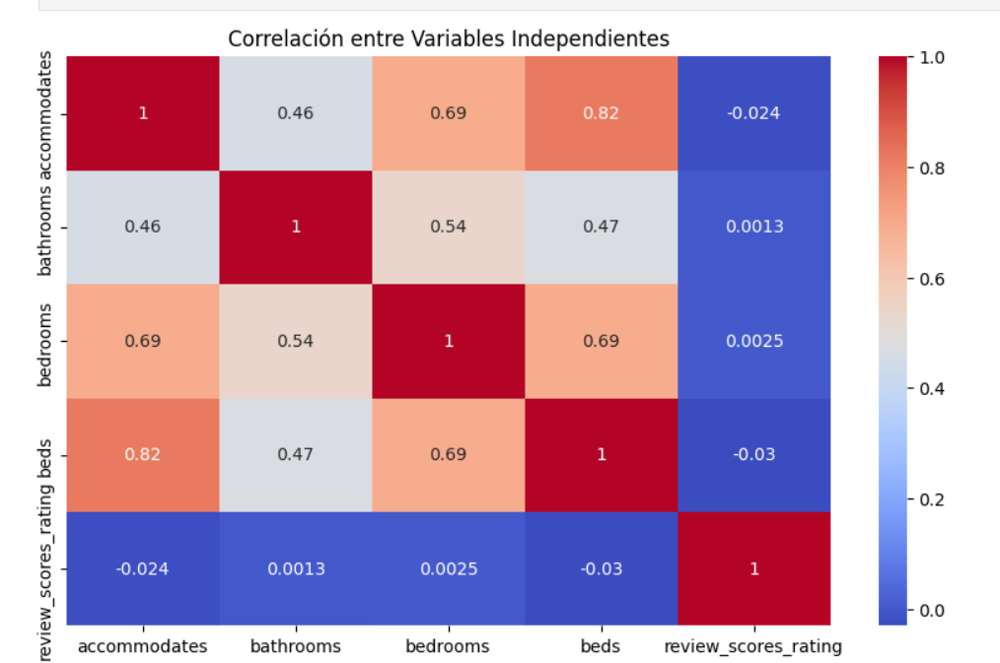

---

# 22. EVALUACIÓN DEL MODELO

```python
y_pred = model.predict(X_test)

r2 = r2_score(y_test, y_pred)

mse = mean_squared_error(y_test, y_pred)

print("R²:", r2)

print("MSE:", mse)
```

## Resultado principal

```python
R² = 0.32
```

## Interpretación

El modelo logró explicar aproximadamente el 32% del comportamiento del precio de las propiedades.

Aunque el resultado puede mejorar, el modelo sí logró encontrar patrones reales dentro del dataset.

Esto ocurre porque el precio también depende de muchos otros factores no incluidos en el modelo, como:

- ubicación exacta,
- temporada,
- servicios incluidos,
- popularidad del anfitrión,
- tipo de propiedad.

---

# 23. PREDICCIONES

```python
comparacion = pd.DataFrame({
    "Valor Real": y_test,
    "Predicción": y_pred
})

print(comparacion.head(10))
```

## Comparación visual

```python
plt.figure(figsize=(8,6))

plt.scatter(y_test, y_pred)

plt.xlabel("Valores Reales")

plt.ylabel("Predicciones")

plt.title("Valores Reales vs Predichos")

plt.show()
```

## Interpretación

La gráfica mostró una tendencia positiva entre valores reales y predicciones.

Esto indica que el modelo sí logró aprender parte importante del comportamiento de los precios.

En algunos casos existieron diferencias entre valores reales y predicciones, lo cual es normal dentro de modelos reales de Machine Learning.

---


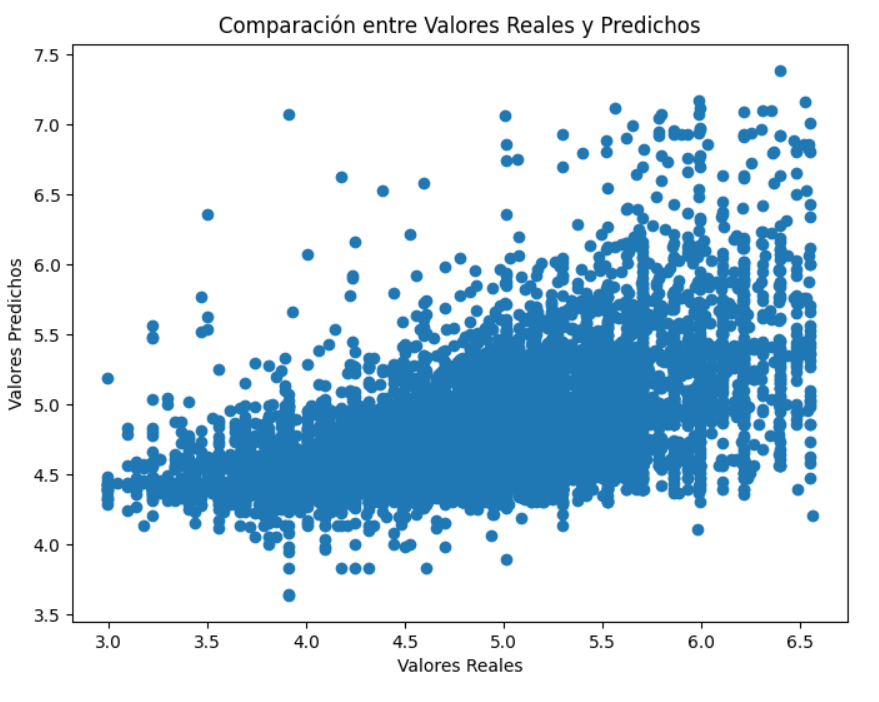

---

# 24. IMPORTANCIA DE VARIABLES

```python
coeficientes = pd.DataFrame({
    "Variable": X.columns,
    "Coeficiente": model.coef_
})

print(coeficientes)
```

## Visualización

```python
sns.barplot(
    x="Coeficiente",
    y="Variable",
    data=coeficientes
)

plt.title("Importancia de Variables")

plt.show()
```

## Interpretación

La variable más importante fue `accommodates`.

Esto significa que mientras más huéspedes puede recibir una propiedad, mayor suele ser el precio.

Las habitaciones y baños también mostraron una influencia positiva importante.

---

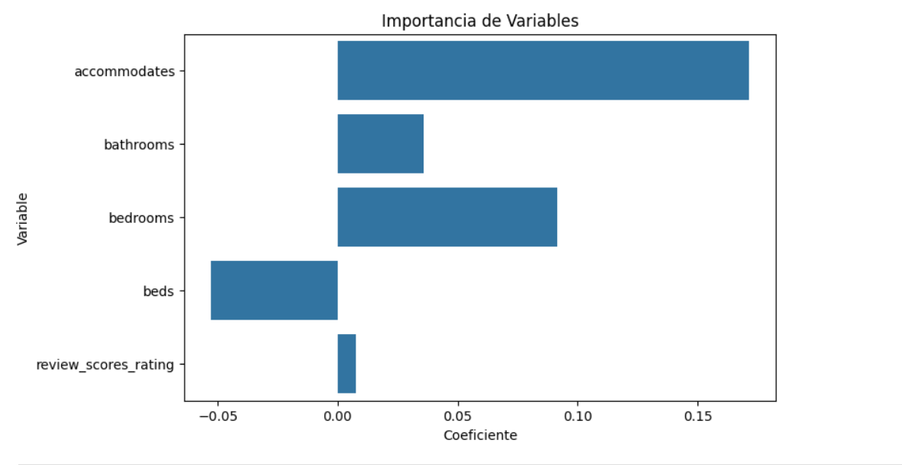

---

# 25. INTERPRETACIÓN GENERAL DE RESULTADOS

Los resultados obtenidos muestran que el precio de las propiedades depende principalmente de características relacionadas con el tamaño y capacidad del alojamiento.

Las variables más importantes fueron:

- accommodates  
- bedrooms  
- bathrooms  

Esto indica que propiedades más grandes y con mayor capacidad suelen tener precios más elevados.

Además, las calificaciones de usuarios también mostraron cierta influencia positiva sobre el precio.

El modelo logró identificar patrones reales dentro del dataset y generar predicciones funcionales utilizando Machine Learning.

---

# 26. APLICACIÓN REAL DEL PROYECTO

Este tipo de modelos puede utilizarse en plataformas reales para:

- Estimar precios automáticamente  
- Recomendar precios competitivos  
- Analizar comportamiento del mercado  
- Detectar propiedades sobrevaloradas  
- Optimizar estrategias de negocio  
- Ayudar en la toma de decisiones comerciales  

Esto demuestra cómo la Ciencia de Datos puede aplicarse en problemas reales utilizando Machine Learning.

---

# 27. APRENDIZAJES OBTENIDOS

Durante este proyecto fortalecí conocimientos importantes relacionados con:

- Python  
- Pandas  
- NumPy  
- Machine Learning  
- Regresión Lineal Múltiple  
- Limpieza de datos  
- Visualización de información  
- Interpretación de resultados  
- Ciencia de Datos  

También comprendí mejor el flujo completo de trabajo dentro de un proyecto de Ciencia de Datos real.

---

# 28. RECOMENDACIONES FUTURAS

Para mejorar el modelo en futuras versiones se recomienda:

- Incorporar más variables  
- Analizar ubicación geográfica exacta  
- Utilizar modelos más avanzados  
- Aplicar validación cruzada  
- Analizar amenities y temporadas  
- Incorporar variables categóricas  

---

# 29. CONCLUSIÓN FINAL

Este proyecto permitió aplicar técnicas reales de Ciencia de Datos y Machine Learning sobre una base de datos real de Airbnb.

A través del análisis exploratorio, limpieza de datos, visualización y construcción del modelo predictivo, fue posible identificar variables importantes que influyen en el precio de las propiedades.

El modelo logró detectar patrones reales y realizar predicciones funcionales utilizando información relacionada con capacidad, habitaciones, baños y calificaciones.

Finalmente, este proyecto demuestra cómo la Ciencia de Datos puede transformar datos en información útil para apoyar decisiones reales mediante técnicas de análisis y Machine Learning.


